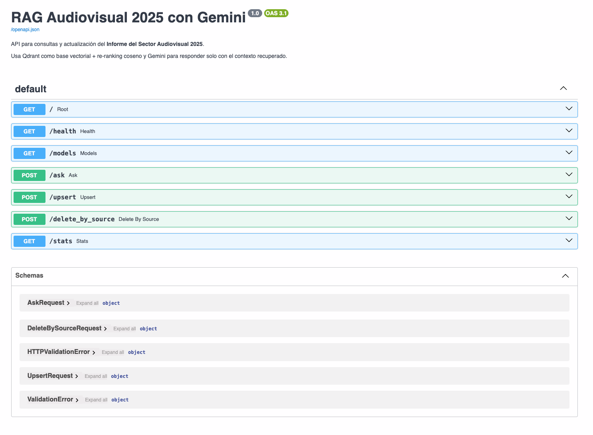
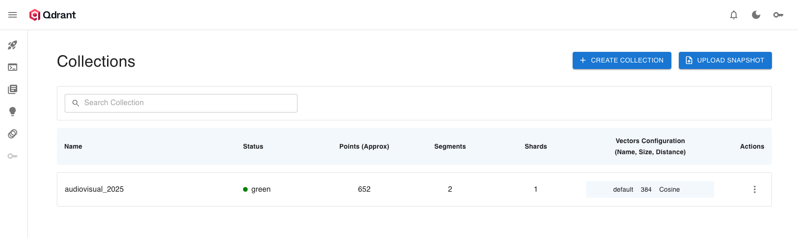
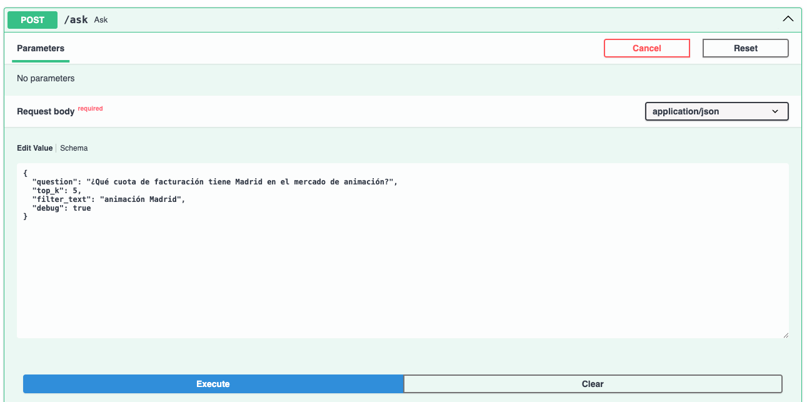
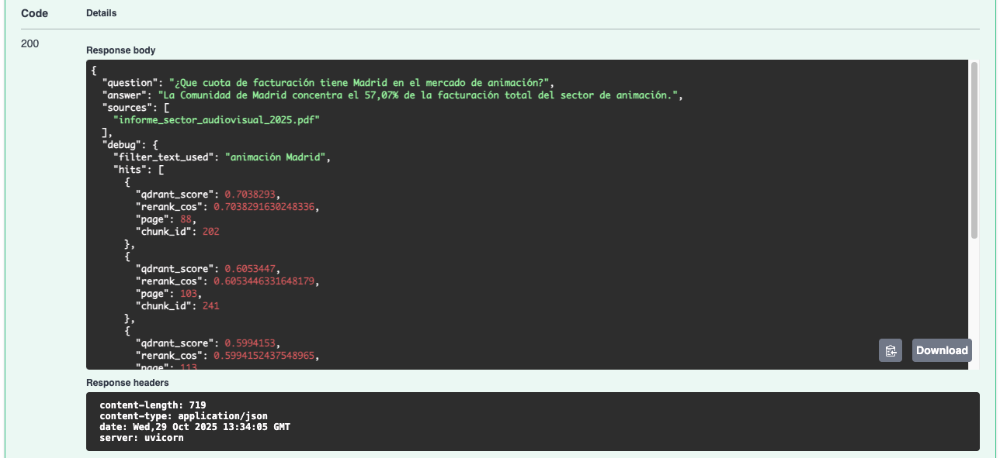

# RAG Audiovisual 2025 (Qdrant + Gemini)

**Objetivo**: Sistema RAG (Retrieval‑Augmented Generation) que indexa el *Informe del Sector Audiovisual 2025* y permite hacer preguntas en español usando **Qdrant** como base vectorial y **Google Gemini** como LLM. Incluye endpoints para consulta y **actualización continua** de datos (upsert desde texto o PDF), métricas y limpieza por fuente.


---

## 🧭 Índice

- [Arquitectura](#arquitectura)
- [Requisitos](#requisitos)
- [Estructura del proyecto](#estructura-del-proyecto)
- [Configuración](#configuración)
- [Arranque rápido](#arranque-rápido)
- [Ingesta / actualización de datos](#ingesta--actualización-de-datos)
- [API (FastAPI)](#api-fastapi)
  - [/health](#get-health)
  - [/models](#get-models)
  - [/ask](#post-ask)
  - [/upsert](#post-upsert)
  - [/upsert_pdf](#post-upsert_pdf)
  - [/delete_by_source](#post-delete_by_source)
  - [/stats](#get-stats)
- [Cómo funciona la recuperación](#cómo-funciona-la-recuperación)
- [Solución de problemas](#solución-de-problemas)

---

## Arquitectura

**Flujo**:

1. Usuario lanza una **pregunta** → `POST /ask`.
2. La pregunta se **vectoriza** con `sentence-transformers`.
3. Qdrant realiza **búsqueda semántica** (k alta) y el servicio hace **re‑ranking local** por coseno.
4. Se forma un **contexto** con fragmentos top‑k (y fuentes).
5. **Gemini** genera la respuesta **solo** con ese contexto (si no está, lo indica).

**Actualización**:

- `POST /upsert`: ingesta de texto (ya troceado o a trocear) con metadatos.
- `POST /upsert_pdf`: ingesta desde un PDF (multipart).
- `POST /delete_by_source`: limpieza de contenidos por `source`.
- `GET /stats`: conteos y diagnóstico rápido.

---

## Requisitos

- Python 3.10–3.12 (⚠️ En 3.14 algunas libs aún están madurando)
- Docker (para Qdrant) y `docker compose`
- Cuenta de Google AI Studio y **GEMINI_API_KEY**

**Python**:

```bash
python -m venv .venv
# macOS / Linux
source .venv/bin/activate
# Windows (PowerShell)
# .venv\Scripts\Activate.ps1

pip install -r requirements.txt
```

**Qdrant** (local):

```bash
docker compose up -d    # levanta Qdrant con volumen en ./qdrant_data
```

---

## Estructura del proyecto

```text
.
├─ .env                                          # variables locales 
├─ .env.example                                  # plantilla de variables 
├─ docker-compose.yaml                           # Qdrant local
├─ Makefile                                      # atajos de desarrollo 
├─ pictures/
│  ├─ image.png                                  # ejemplo de petición a /ask
│  ├─ image-1.png                                # ejemplo de respuesta de /ask
│  ├─ image-2.png                                # UI de endpoints
│  └─ Qdrant.png                                 # interfaz en Qdrant 
├─ qdrant_config/
│  └─ config.yaml                                # configuración avanzada 
├─ qdrant_data/                                  # datos persistentes de Qdrant (se crea al arrancar)
├─ data/
│  ├─ raw/
│  │  └─ informe_sector_audiovisual_2025.pdf
│  ├─ interim/
│  │  ├─ informe_sector_audiovisual_2025.txt
│  │  └─ informe_sector_audiovisual_2025.json
│  └─ processed/
│     └─ chunks.jsonl                             # trozos ya procesados (si se usa flujo offline)
├─ scripts/
│  ├─ create_qdrant_collection.py                 # crea/asegura colección + índice text
│  ├─ metadata_enricher.py                        # ejemplo de enriquecimiento de payload
│  ├─ query_points.py                             # prueba de consultas a Qdrant
│  ├─ reset_collection.py                         # recrea (borra datos)
│  └─ upsert_chunks.py                            # ingesta desde JSONL (offline)
├─ src/informe_sector_audiovisual_2025/
│  ├─ api_rag.py                                  # FastAPI: /ask, /upsert, /upsert_pdf, /delete_by_source, /stats
│  ├─ chunking.py                                 # troceo configurable (tamaño, solape, normalización)
│  ├─ embeddings.py                               # carga y uso del modelo de embeddings
│  ├─ ingest_pdf.py                               # extracción de texto con PyMuPDF/pdfminer.six
│  ├─ config.py                                   # utilidades de configuración
│  └─ __init__.py
├─ pyproject.toml                                 # metadatos del proyecto (nombre, versión) 
├─ requirements.txt                               # dependencias de ejecución
└─ docs/
   └─ memoria-informe-audiovisual-2025.pdf        # memoria del proyecto

```

---

## 🧰 Scripts de procesamiento e indexado

Estos scripts permiten ejecutar el flujo **offline** paso a paso antes de usar la API.  
Cada uno puede lanzarse manualmente con `PYTHONPATH=src python scripts/<nombre>.py`.

| Orden | Script | Descripción breve |
|:--:|:--|:--|
| **1️⃣** | `ingest_pdf.py` | Extrae texto del PDF original y genera:<br>→ `data/interim/informe_sector_audiovisual_2025.json` (páginas)<br>→ `data/interim/informe_sector_audiovisual_2025.txt` (texto plano concatenado). |
| **2️⃣** | `chunking.py` | Divide el texto plano en fragmentos (~1000 caracteres, con solape de 150). Crea `data/processed/chunks.jsonl`. |
| **3️⃣** | `metadata_enricher.py` | Asocia cada fragmento con su número de página y añade metadatos (`page`, `section`, `source`). Sobrescribe `chunks.jsonl` enriquecido. |
| **4️⃣** | `create_qdrant_collection.py` | Crea (si no existe) la colección `audiovisual_2025` en Qdrant, con vector size y métrica `COSINE`. Añade un índice `MatchText` sobre `text`. |
| **5️⃣** | `upsert_chunks.py` | Inserta en Qdrant los chunks ya enriquecidos. Calcula embeddings, genera IDs deterministas y realiza `upsert`. |
| **6️⃣** | `query_points.py` | Verifica la indexación consultando Qdrant con una frase de prueba. Devuelve textos más relevantes con su score. |
| **7️⃣** | `reset_collection.py` *(opcional)* | Elimina y recrea la colección desde cero. Útil para reiniciar la base vectorial durante pruebas. |

📌 **Consejo**:  
Antes de lanzar la API FastAPI, asegúrate de haber ejecutado los pasos **1 → 5**, para que la colección esté lista y poblada.

---

## Configuración

Crea un `.env` en la raíz (o copia desde `.env.example`):

```env
# Gemini
GEMINI_API_KEY=xxxxxxxxxxxxxxxxxxxxxxxxxxxxxxxx
GEMINI_MODEL=models/gemini-2.5-flash

# Qdrant
QDRANT_HOST=localhost
QDRANT_PORT=6333
QDRANT_COLLECTION=audiovisual_2025

# Embeddings
EMBEDDINGS_MODEL=intfloat/multilingual-e5-small
```

> Puedes listar modelos disponibles con `GET /models` y cambiar `GEMINI_MODEL` si lo deseas.

---

## Arranque rápido

1) **Levantar Qdrant**

```bash
docker compose up -d
```



2) **Crear/asegurar la colección e índice de texto**

```bash
PYTHONPATH=src python scripts/create_qdrant_collection.py
```

Este script crea la colección `audiovisual_2025` con distancia **COSINE** y un índice de payload sobre el campo `text` para búsquedas `MatchText`.

3) **Lanzar la API**

```bash
PYTHONPATH=src uvicorn informe_sector_audiovisual_2025.api_rag:app --reload
```

Abre `http://127.0.0.1:8000/docs` para la UI.

---

## Ingesta / actualización de datos

### A) Upsert de **texto** (troceado automático)

```bash
curl -X POST "http://127.0.0.1:8000/upsert" \
  -H "Content-Type: application/json" \
  -d '{
        "text": "Este es un texto largo con datos que quiero indexar...",
        "source": "nota_prensa_2025",
        "max_chars": 1000,
        "overlap": 120
      }'
```

- Si pasas `text` (string), el servicio lo **trocea** y lo indexa.
- Si pasas `texts` (lista de trozos), los indexa tal cual.
- Añade metadatos útiles: `source`, `page`, `chunk_id`, `created_at`.

### B) Upsert desde **PDF** (multipart)
>
> Requiere `python-multipart` (incluido en `requirements.txt`).

```bash
curl -X POST "http://127.0.0.1:8000/upsert_pdf" \
  -F "file=@data/raw/informe_sector_audiovisual_2025.pdf" \
  -F "source=informe_sector_audiovisual_2025.pdf" \
  -F "max_chars=1000" \
  -F "overlap=120"
```

### C) Borrado por **source**

```bash
curl -X POST "http://127.0.0.1:8000/delete_by_source" \
  -H "Content-Type: application/json" \
  -d '{"source":"nota_prensa_2025"}'
```

### D) **Estadísticas**

```bash
curl "http://127.0.0.1:8000/stats"
```

---

## API (FastAPI)

### GET `/health`

Comprueba variables de entorno y acceso a Qdrant. **200 OK**:

```json
{
  "status": "ok",
  "gemini_key": true,
  "qdrant": true,
  "model": "models/gemini-2.5-flash"
}
```

### GET `/models`

Lista los modelos de Gemini que soportan `generateContent`.

### POST `/ask`

Consulta con recuperación + re‑ranking + respuesta de Gemini **basada exclusivamente en el contexto**.

**Body**:

```json
{
  "question": "¿Qué cuota de facturación tiene Madrid en el mercado de animación?",
  "top_k": 5,
  "filter_text": "animación Madrid",
  "debug": true
}
```

**UI**


**Ejemplo de respuesta**


### POST `/upsert`

Inserta/actualiza embeddings desde **texto**. Ver sección [Ingesta](#ingesta--actualización-de-datos).

### POST `/upsert_pdf`

Inserta/actualiza desde **PDF** (multipart). Ver sección [Ingesta](#ingesta--actualización-de-datos).

### POST `/delete_by_source`

Elimina puntos cuyo `payload.source` coincida. Útil para reemplazar informes/ notas obsoletas.

### GET `/stats`

Devuelve el número de puntos y los recuentos por `source` para diagnóstico rápido.

---

## Cómo funciona la recuperación

- **Embeddings**: `sentence-transformers intfloat/multilingual-e5-small` (configurable en `embeddings.py`) optimizado para español, 384 dimensiones.
- **Qdrant**: distancia **COSINE**; se pide un `k` generoso para buen *recall* y se hace **re‑ranking local** por coseno con el vector de la pregunta.
**Filtro semántico**: `filter_text` activa un `MatchText` sobre el campo `text` (índice creado por `scripts/create_qdrant_collection.py`).
- **Prompting**: instrucción en español con *guardrail*: si la info **no está** en el contexto, **lo dice**.

---

## Solución de problemas

- **Embeddings**: si hay errores al cargar el modelo, revisa embeddings.py y asegúrate de que `EMBEDDINGS_MODEL` está definido como `intfloat/multilingual-e5-small` en tu `.env`.
- **Modelos Gemini**: si recibes error de modelo, revisa `GET /models` y ajusta `GEMINI_MODEL` en `.env`.
- **Versión de Python**: si estás en 3.14 y alguna lib falla, usa 3.12 para máxima compatibilidad.
- **Colección/índice**: ejecuta `PYTHONPATH=src python scripts/create_qdrant_collection.py` para crear o recrear colección e índice de texto.

---

## 11) Autoría

- Ana Belén Ballesteros Redondo  
  🔗 [LinkedIn](https://www.linkedin.com/in/ana-belén-ballesteros-redondo/)

📑 **Memoria del proyecto:**  
[Visualizar PDF](docs/memoria-informe-audiovisual-2025.pdf) — documento completo de diseño, resultados y análisis.
